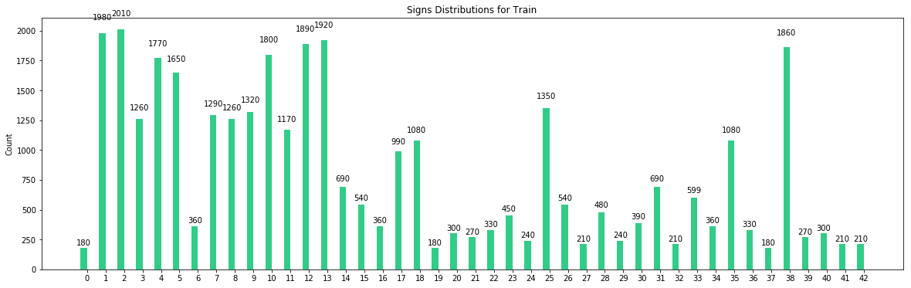
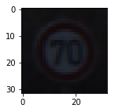

#**Traffic Sign Recognition** 

**Build a Traffic Sign Recognition Project**

The goals / steps of this project are the following:

* Step 1: loading and visualizing images and labels for training/validation/testing
* Step 2: preprocessing images
* Step 3: building a multilayer neural network model to predict signs 
* Step 4: optimizing model's cost and tuning weights/biases
* Step 5: evaluating the model based on validation set
* Step 6: downloading and testing a few extra samples from the web (analyzing them by precision and recall of each sign)
* Step 7: evaluating test set
* Step 8: visualizing feature map with sample image from test set
* goals: achieving a high accuracy on test images 

### Dataset Exploration

Dataset in this expermient consists of 32x32 images with 3 channels and 43 labels of traffic signs. 
 * Training data size: 34799
 * Validation data size: 4410
 * Testing data size: 12630
 * Note: after adding noise to training set , its size increases to 35299
 
I visualized training-set based on the frequency of signs to get a better undesrtanding of how well model can be trained based on the variations and if the number of images (for each sign) in the data has a direct impact on the accuracy of model to predict labels.

As shown above, the number of images for some of the signs such as [0-Speed limit (20km/h)] , [19-Dangerous curve to the left] or [37-Go straight or left] is relatively smaller than the other signs with frequecy higher than 1200 such as [1-Speed limit (30km/h)]. 
Depending on image qualities model might not perform well enough on detecting signs with fewer training samples in comparison to the ones with 1200 samples.

Picking random images from training set also shows that not all images have good qualities. Dark shades or bad sun exposure can make signs look similar to some of the other signs which can also introduce noise into the model. One sample is shown below

## Design and Test a Model Architecture

### Network
Although colors play an important role to show the type of traffic signs, there are also variety of reasons which might affect these colors and how they're reflected to drivers; Such as signs in dark shadows of trees/mountains or being exposed different sun angles thorughout the day. In order to train the nework independenlty from the color-factor and to reduce complexity, I performed a preprocessing step on images to convert them to grayscale and cutting down 3-channels to only 1-channel, I also normalized images with mean 0 and ((1)) << , to get a better distribution.(....) Training-labels or Y-train are also converted to one-hot format.

Preprocessing on 2 images:

 

 

After preprocessing step, images are ready to train the model, but in order to make model even more independent from the data, I added noise to 500 random images and appended them to the training set, which in result increase the size of training set to 35299 which improved my model accuracy on 7 web-sample images

Here are 2 examples of extra images with added noise:

 

 

Network used for this exercise consists of 6 layers similar to LeNet structure, input, 4 hidden layers and output:

  * input layer: 32x32x1 images connect with 5x5x1x6 weights to 1st hidden layer
  * conv1 layer: is convolutional layer with filter size of 5x5x1, depth of 6 and stride of 1 and. After passing thorugh filters biases are added and data gets actiavted with relu to ((3)). Pooling method used in this layer is max_pool with kernel size of 2 to reduce the size of output to 10x10x6. 
  * conv2 layer: is the 2nd convolutional layer with filter size of 5x5x6, depth of 16 and stride of 1. Similar to previous layer, after passing thorugh filters biases are added and data gets actiavted with relu to ((3)). Pooling method used in this layer is max_pool with kernel size of 2 to reduce the size of output to 5x5x16. 
  * f1 layer: is a fully connected layer with 120 nodes, in order to pass outputs of conv2 layer to this layer, it should be reshaped to a flat array 400x1. Weights connecting conv2 to f1 are 400x120 and 120 biases are added to the output. Regularization method used in this layer is drop_out of 50% to prevent model from overfitting.
  * f2 layer: is another fully connected layer with 84 nodes, connected with 120x84 weights from f1 layer and 84 biases. 50% Drop_out is applied to this layer as well as f1.
  * output layer: is the final layer with 43 nodes, 84x43 weights and 43 biases, which classifies the results into 43 categories of signs
 
I started training with 10 epochs but the accuracy wasn't below 90%, considering that learning-reat is 0.001 and 50% of outputs to f1 & f2 layers are dropping in each iteration I increased epochs to 30 and achieved higher accuracy. Optimizer used in this network is Adamoptimzer which minimizes model's cost that is the distance of predicted-labels from target-labels. 
Final training configuration:
 - Optimizer: Adamoptimizer
 - learning-rate : 0.001
 - epochs: 30
 - batch-size : 128
 - drop_out: 0.5

### Evaluation
For measuring accuracy of each epoch, validation-set is passed to the model and the average number of correctly predicted labels is printed out, some of the iterations results:

| Epoch         | Accuracy      |
| ------------- |:-------------:|
| 0             | 0.572         |
| 15            | 0.933         |
| 29            | 0.954         |

### Testing model on new images

In this practice, I found 7 sample images from web, preprocessed them and ran them through the model:
        

overall accuracy shows 0.571, model performs very well on the first 4 images but acts poorly on the rest of them

Image 0: 1,Speed limit (30km/h) [Predicted: Correct]

| Top 3 Softmax probablities                                   | Top 3 softmax probablities                                       |
| -------------------------------------------------------------|:----------------------------------------------------------------:|
||<ul><li>probablity: 97.95446014404297 , sign: 1,Speed limit (30km/h)</li><li>probablity: 0.615595817565918 , sign: 4,Speed limit (70km/h)</li><li>probablity: 0.5799821615219116 , sign: 0,Speed limit (20km/h)</li></ul>    | 

Image 1: 12,Priority road [Predicted: Correct]

| Top 3 Softmax probablities                                   | Top 3 softmax probablities                                       |
| -------------------------------------------------------------|:----------------------------------------------------------------:|
||<ul><li>probablity: 100.0 , sign: 12,Priority road</li><li>probablity: 2.082616455610628e-25 , sign: 40,Roundabout mandatory</li><li>probablity: 7.620977317941738e-32 , sign: 15,No vehicles</li></ul>         | 

Image 2: 14,Stop [Predicted: Correct]

| Top 3 Softmax probablities                                   | Top 3 softmax probablities                                       |
| -------------------------------------------------------------|:----------------------------------------------------------------:|
||<ul><li>probablity: 99.99974060058594 , sign: 14,Stop</li><li>probablity: 0.00011504661233630031 , sign: 12,Priority road</li><li>probablity: 7.005963561823592e-05 , sign: 33,Turn right ahead</li></ul>    |

Image 3: 25,Road work [Predicted: Correct]

| Top 3 Softmax probablities                                   | Top 3 softmax probablities                                       |
| -------------------------------------------------------------|:----------------------------------------------------------------:|
|| <ul><li>probablity: 94.52849578857422 , sign: 25,Road work</li><li>probablity: 5.44403076171875 , sign: 22,Bumpy road</li><li>probablity: 0.01412796694785 , sign: 31,Wild animals crossing</li></ul>    |

Image 4: 23,Slippery road [Predicted: Incorrect] _Actual Sign: 31,Wild animals crossing_

| Top 3 Softmax probablities                                   | Top 3 softmax probablities                                       |
| -------------------------------------------------------------|:----------------------------------------------------------------:|
||<ul><li>probablity: 99.63726043701172 , sign: 23,Slippery road</li><li>probablity: 0.2470851391553 , sign: 10,No passing for vehicles ..</li><li>probablity: 0.08363259583711624 , sign: 31,Wild animals crossing</li></ul> |

Image 5: 11,Right-of-way at the next intersection [Predicted: Incorrect] _Actual Sign: 23,Slippery road_

| Top 3 Softmax probablities                                   | Top 3 softmax probablities                                       |
| -------------------------------------------------------------|:----------------------------------------------------------------:|
||<ul><li>probablity: 86.93489074707031 , sign: 11,Right-of-way at the ...</li><li>probablity: 2.6319382190704346 , sign: 30,Beware of ice/snow</li><li>probablity: 2.462770700454712 , sign: 37,Go straight or left</li></ul>     |

Image 6: 18,General caution [Predicted: Incorrect] _Actual Sign: 21,Double curve_

| Top 3 Softmax probablities                                   | Top 3 softmax probablities                                       |
| -------------------------------------------------------------|:----------------------------------------------------------------:|
||<ul><li>probablity: 71.21922302246094 , sign: 18,General caution</li><li>probablity: 12.32940673828125 , sign: 12,Priority road</li><li>probablity: 11.075485229492188 , sign: 26,Traffic signals</li></ul>         |

